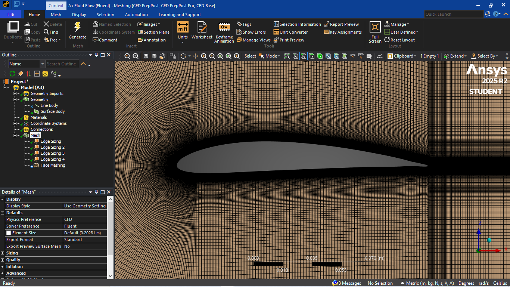
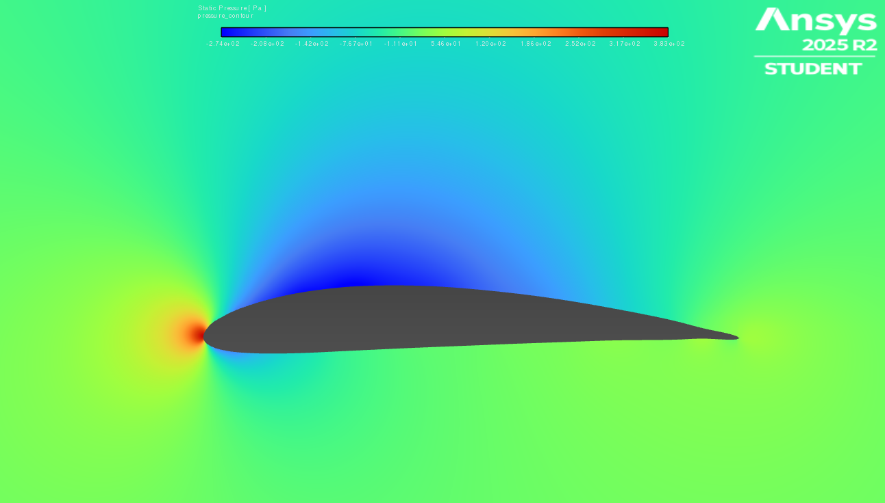
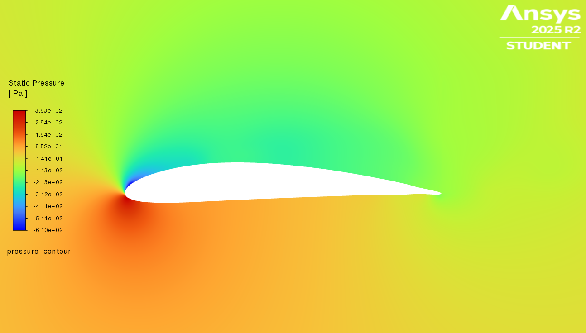
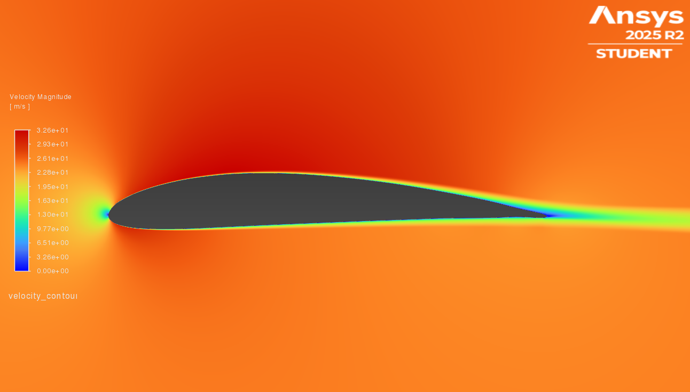
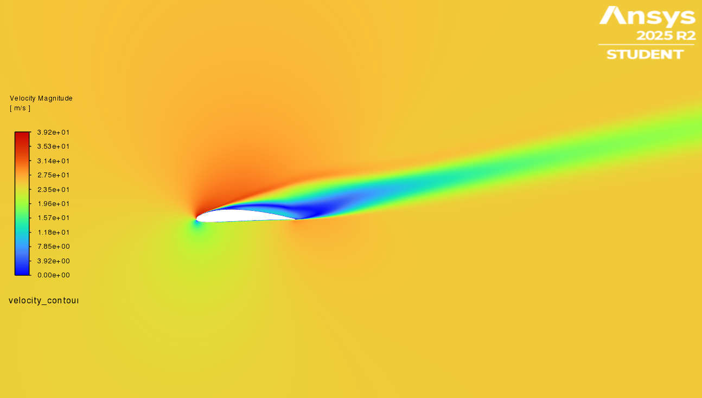

# NACA 4412 CFD Analysis Using ANSYS Fluent

## Overview

This project investigates the aerodynamic characteristics of the NACA 4412 airfoil using Computational Fluid Dynamics (CFD) and experimental validation.

The analysis was conducted at a Reynolds number of approximately 50,000 using ANSYS Fluent and the k-ω SST turbulence model.

---

## Objectives

- Evaluate lift and drag characteristics
- Investigate pressure distribution
- Analyze velocity contours
- Determine stall angle
- Compare CFD and experimental results

---

## Simulation Parameters

| Parameter | Value |
|------------|---------|
| Airfoil | NACA 4412 |
| Chord Length | 150 mm |
| Reynolds Number | 50,000 |
| Velocity | 25 m/s |
| Turbulence Model | k-ω SST |
| AoA Range | -4° to 16° |

---

## Key Results

| AoA (deg) | CL | CD |
|------------|---------|---------|
| -4 | -0.029 | 0.0075 |
| 0 | 0.046 | 0.00317 |
| 4 | 0.0552 | 0.00665 |
| 8 | 0.142 | 0.0057 |
| 12 | 0.136 | 0.0127 |
| 16 | 0.099 | 0.294 |

---

## Major Findings

- Stall observed near 12° angle of attack
- Lift increased progressively up to stall
- Significant flow separation observed at higher AoA
- CFD results showed good agreement with experimental trends

---

## Software Used

- Fusion 360
- ANSYS Fluent

---

## Author

Shruti Jaykumar Wani

B.Tech Aerospace Engineering

## CFD Results

### Mesh

### Pressure Contour at 0°

### Pressure Contour at 12°

The pressure contour shows a strong suction region near the leading edge followed by pressure recovery, indicating the onset of separation near stall.

### Velocity Contour at 0°

### Velocity Contour at 12°

The velocity contour reveals a widened wake and separated flow region on the upper surface, confirming stall behaviour.

## Project Files

- Full Report: [4412 Report.pdf](4412%20Report.pdf)

## Key Engineering Skills Demonstrated

- Computational Fluid Dynamics (CFD)
- ANSYS Fluent
- Structured Mesh Generation
- Aerodynamic Analysis
- Lift and Drag Evaluation
- Pressure Contour Analysis
- Velocity Contour Analysis
- Stall Prediction
- Low Reynolds Number Aerodynamics
